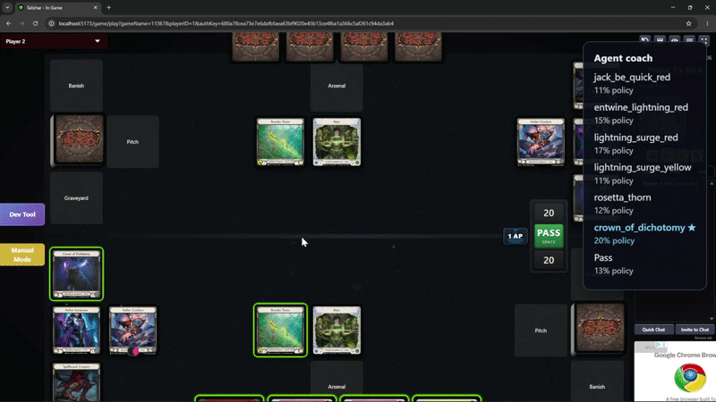

# Flesh and Blood rlbridge

Reinforcement-learning simulation for [Flesh and Blood](https://fabtcg.com/) TCG, built on [Talishar](https://talishar.net/) as the game engine.



*Example usage: play against AI agents with guidance for optimal play based on millions of simulated matches.*

---

## Quick start (GUI)

**Prerequisites:** [Docker Desktop](https://www.docker.com/products/docker-desktop/) and **Python 3.10+**.

### Option A - Docker (simplest: Talishar + GUI together)

```bash
git clone https://github.com/pdfosborne/flesh-and-blood-rlbridge.git
cd flesh-and-blood-rlbridge
docker compose up --build
```

Open **http://localhost:8765** in your browser. The Talishar game server is started automatically on port **8080**.

Training output and saved sideboard lists are written to **`results/`** in the repo (e.g. `results/sideboard_compare/`, `results/tui_decks/saved/`). Generated deck files for final evaluation are written to **`Talishar/Assets/`** (shared with the Talishar container).

If you also run Talishar separately (e.g. `cd Talishar && docker compose up`), stop that stack first so port **8080** and **`Talishar/Assets`** are not split across two instances.

Stop everything with `Ctrl+C`, then:

```bash
docker compose down
```

### Option B - Local Python (recommended for development)

**Windows (PowerShell):**

```powershell
git clone https://github.com/pdfosborne/flesh-and-blood-rlbridge.git
cd flesh-and-blood-rlbridge
.\scripts\setup.ps1
fab-gui
```

**macOS / Linux:**

```bash
git clone https://github.com/pdfosborne/flesh-and-blood-rlbridge.git
cd flesh-and-blood-rlbridge
chmod +x scripts/setup.sh
./scripts/setup.sh
source .venv/bin/activate && fab-gui
```

`setup` creates a venv, installs the package, verifies `Talishar/Assets`, and starts the Talishar backend via Docker.

### Commands

| Command | What it does |
|---------|----------------|
| `fab-gui` | Web GUI for sideboard comparison (http://localhost:8765) |
| `fab-tui` | Interactive terminal menu |
| `fab-bridge init` | First-time setup: dirs + Talishar backend |
| `fab-bridge doctor` | Check Python, Docker, Assets, card DB |
| `fab-bridge talishar --down` | Stop Talishar Docker containers |
| `python start_talishar.py --backend-only` | Start Talishar only (cross-platform) |

Legacy entry points `python main.py` and `python main.py gui` still work.

---

## Overview

This package wraps the [Talishar](https://talishar.net/) server into Gym-compatible RL environments and provides a full training/evaluation/simulation stack:

- **Self-play training** with PPO dual-agent pipelines
- **Three-phase workflow** - tune decks via targeted swaps (Phase 1), auto sideboard per matchup with manual override (Phase 2), train play agents (Phase 3)
- **Format-rule enforcement** - deck-size caps (e.g. Silver Age = 40), hero + full equipment required, token cards excluded from counts
- **FaBrary integration** - fetch real decks by URL or slug; auto-sideboard to meet format rules
- **C++ fast simulation** - compiled pybind11 engine replaces the HTTP game server for training (up to 50× faster, fully thread-safe)
- **MCP tools** - expose training and simulation tasks to AI assistants via the rlbridge MCP plugin


---

## Talishar Setup

The RL pipeline requires the Talishar game server running locally.

| Component | Directory | Default URL |
|-----------|-----------|-------------|
| Talishar backend (PHP + Docker) | `Talishar/` | `http://localhost:8080` |
| Talishar-FE (Vite, optional) | `Talishar-FE/` | `http://localhost:5173` |

> **The FE is only needed for GIF rendering and live browser play.** Training and the web GUI work with the backend alone.

### Installing Talishar-FE

Talishar-FE is a separate repository and is **not** included when you clone this project. Clone it as a sibling of `Talishar/` (repo root):

```bash
git clone https://github.com/Talishar/Talishar-FE
cd Talishar-FE
npm install
```

Then start the Vite dev server (with the Talishar backend already running):

```bash
npm run dev
# or from the rlbridge repo root:
python start_talishar.py --fe-only
```

Open **http://localhost:5173** for live play. Option **5** in the TUI also requires this frontend.

### Starting and stopping

```bash
# Start backend + FE
python start_talishar.py

# Backend only (recommended for training)
python start_talishar.py --backend-only
fab-bridge talishar --backend-only

# FE only (backend already running)
python start_talishar.py --fe-only

# Stop backend containers
python start_talishar.py --down
fab-bridge talishar --down
```

Or use Docker Compose from the repo root (starts backend + GUI):

```bash
docker compose up --build
```

---

## Interactive launcher

| Entry point | Description |
|-------------|-------------|
| `fab-gui` | Web GUI for sideboard comparison |
| `fab-tui` | Rich-based terminal UI (default menu) |
| `fab-bridge sage` | Non-interactive SAGE deckbuilder pipeline |
| `python main.py` | Same as `fab-tui` (compatibility) |

### TUI main menu

| # | Option | What it does |
|---|--------|----------------|
| **1** | Sideboard comparison | Full sideboard-tuning pipeline: pick your deck and a SAGE precon opponent, generate swap variants, train play agents in parallel, and compare candidates. |
| **2** | Fixed deck simulation | Train play agents on two fixed decks (FaBrary URL/slug or local JSON) with optional C++ engine acceleration. |
| **3** | Evaluate checkpoints | Win-rate evaluation or GIF render-only replay from saved phase-3 checkpoints; can watch for new checkpoints. |
| **4** | Evaluate trained agent | Run additional Talishar eval games against a **completed** training run (latest checkpoint). |
| **5** | Real-time Talishar play | Open the live Talishar frontend in Chromium to **watch** the agent or **play against it**. |
| **6** | Settings | Talishar backend/FE URLs, Assets path, FaBrary API key; rescan `cards.json`; normalize card IDs for Talishar. |

**Talishar requirements by menu option:**

- Options **3–5** need the Talishar backend (`fab-bridge init` or `python start_talishar.py --backend-only`).
- Option **5** also needs Talishar-FE (`python start_talishar.py` without `--backend-only`).

---

## Implementation status

### Three-phase pipeline

| Step | Status | Notes |
|------|--------|-------|
| **Phase 1 - Deck tuning** | ✓ | Starting from a deck, swap specific cards and evaluate variants by win rate (e.g. sideboard comparison). |
| **Phase 2 - Sideboard** | ✓ | A default policy auto-selects the game deck for each matchup; you can override manually when needed. |
| **Phase 3 - Play** | ✓ | Dual-agent PPO self-play. Training uses the **C++ engine** when built; checkpoints and final eval can use Talishar HTTP. |
| **Final evaluation** | ✓ | Win-rate games on the Talishar backend; optional GIF replay via Talishar-FE + Playwright. |

### TUI & launcher

| Step | Status | Notes |
|------|--------|-------|
| **1 - Sideboard comparison** | ✓ | Swap variants, parallel Phase 3 training, HTML dashboard. |
| **2 - Fixed deck simulation** | ✓ | Two fixed decks, optional C++ engine, play training + final eval. |
| **3 - Evaluate checkpoints** | ✓ | Win-rate eval or GIF render-only; can watch for new checkpoints. |
| **4 - Evaluate trained agent** | ✓ | Extra Talishar eval games against a completed run. |
| **5 - Real-time Talishar play** | ✓ | Watch agent or play against it in Chromium; optional agent-coach overlay. |
| **6 - Settings** | ✓ | Talishar URLs, Assets path, FaBrary key, card DB rescan / ID normalization. |
| **Agent coach overlay** | ✓ | Policy % and C++ win estimates during human vs agent play. |

### Reinforcement Learning Agents

| Step | Status | Notes |
|------|--------|-------|
| **PPO** | ✓ | Simple PPO agent implementation. |
| **Warm-start Training** | ✓ | Logic based policy (best net attack for current hand) used for early exploration. |
| **Agent Cache** | ✓ | Store trained agents, re-use for future runs. |

### Simulation backends

| Backend | Status | Notes |
|---------|--------|-------|
| **HTTP Talishar** | ✓ | Full FaB rules via local Docker backend. Required for live play, GIF rendering, and authoritative final eval. |
| **C++ engine** | Partial | Auto-generated per matchup (`scripts/cpp/generate_cpp_engine.py`). Fast and thread-safe for training, but uses a simplified turn loop and **per-card stubs** that must be translated from Talishar PHP. |
| **C++ ↔ Talishar parity** | Partial | Checker at `scripts/cpp/check_cpp_vs_talishar_parity.py`; expect discrepancies until card stubs are finished. |
| **Legacy Python simulator** | ✓ | `FleshAndBloodGameplayEnvironment` - lightweight scripted opponent, not full Talishar rules. |

### Integrations & tooling

| Feature | Status | Notes |
|---------|--------|-------|
| **FaBrary deck fetch** | ✓ | URL, slug, or local JSON throughout TUI and training scripts. |
| **Format rules** | ✓ | Silver Age, Classic Constructed, Blitz, UPF (SAGE maps to Silver Age). |
| **MCP tools** | ✓ | `fab_simulate_matchup`, `fab_simulate_vs_fixed_opponent`, `fab_run_full_pipeline`, `fab_start_talishar`. |
| **Card database** | ✓ | ~6,900 cards; rescan from FAB Card Vault; Talishar ID normalization. |

### Not yet implemented or intentionally limited

- **Full Talishar fidelity in C++ training** - training win rates reflect the compiled C++ engine, not Talishar due to runtime costs.
- **Complete card effect coverage** - ~447 cards still have partial, unparsed, or missing effect logic (see `card_db/unimplemented_cards.md`).
- **Arbitrary-deck C++ engine without build step** - each matchup needs generation + compile under `results/cpp_engines/`.
- **Cloud / remote Talishar** - workflows assume a local backend.

---

## Prerequisites

| Dependency | Minimum version | Notes |
|------------|----------------|-------|
| Python | 3.10 | 3.12 recommended |
| Docker Desktop | Latest | Talishar backend (required for GUI training eval) |
| Node.js / npm | 18 | Talishar-FE only (live play / GIF) |
| CMake | 3.21 | C++ engine build (optional, faster training) |
| C++ compiler | MSVC 2022 / GCC 11 | C++ engine build |

Run `fab-bridge doctor` to verify your environment.

---

## C++ Engine

`scripts/cpp/generate_cpp_engine.py` scans ≈50 Talishar PHP source files and auto-generates a self-contained C++ game engine. The compiled output is a Python extension module placed in a **content-hashed** directory under `results/cpp_engines/{matchup}-{hash}/`.

| | HTTP environments | C++ engine |
|--|--|--|
| Typical speed | 0.05 games/s | 5-10 games/s |

---

## Card Database

Card and hero metadata live in `src/flesh_and_blood_rlbridge/card_db/`. The database (`cards.json`, ~6,900 cards) is the authoritative source for equipment slots, weapon types, hero variants, and token identification.

To refresh from an upstream export:

```bash
cd src/flesh_and_blood_rlbridge/card_db
python import_from_talishar.py --source /path/to/upstream_cards.json --out cards.json
```

---

## Repository

https://github.com/pdfosborne/flesh-and-blood-rlbridge
